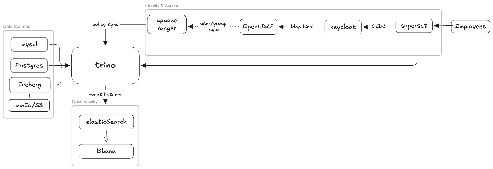

# DataWave SQL Federation Platform

A SQL federation platform running locally via Docker Compose. **Trino** federates three data sources — PostgreSQL (logistics), MySQL (inventory), and an Apache Iceberg data lake on MinIO/S3 — through a single SQL endpoint. **Apache Superset** is the BI and SQL interface; it passes the logged-in user's identity to Trino so **Apache Ranger** group policies enforce per-user access control. Every authorization decision is indexed in **Elasticsearch** for audit.



**Docs:** [Architecture](docs/architecture.md) · [User Management](docs/user-management.md) · [Prod Improvements](docs/prod-improvements.md) · [Troubleshooting](docs/troubleshooting.md)

---

## Prerequisites

- **Docker Desktop 4.x+** (Mac/Windows) or **Docker Engine 24+ with Compose v2** (Linux)
- At least **8 GB RAM** allocated to Docker (Ranger + Elasticsearch are the heaviest services)
- Ports 389, 5432, 3306, 6080, 8080, 8085, 8088, 8180, 8983, 9000, 9001, 9200, 19120, 5601 available
- **Apple Silicon (M1/M2/M3):** fully supported — `platform: linux/amd64` is set on the four x86-only images (OpenLDAP, phpLDAPadmin, Ranger, Ranger-Solr); Docker Desktop uses Rosetta 2 to run them transparently

---

## Quick Start

```bash
git clone <repository-url>
cd datahub
cp .env.example .env          # edit values for non-local deployments
docker compose up --build -d
```

`--build` is required on first run to build the Superset image with the Trino driver. Apache Ranger takes 2–3 minutes to initialise its database schema; Keycloak imports the realm on first boot (~60s). **Total first-boot time: ~7–10 minutes.**

### Confirm everything is healthy

```bash
docker compose ps
```

All services should reach `healthy` or `running`:

```
NAME                        STATUS
datawave-postgres           healthy
datawave-mysql              healthy
datawave-minio              healthy
datawave-nessie             healthy
datawave-openldap           healthy
datawave-keycloak           healthy
datawave-trino              healthy
datawave-ranger-solr        healthy
datawave-ranger             healthy
datawave-ranger-sync        running
datawave-phpldapadmin       running
datawave-elasticsearch      healthy
datawave-kibana             healthy
datawave-superset           healthy
```

Init containers (`datawave-minio-init`, `datawave-es-init`, `datawave-kibana-init`, `datawave-superset-init`) will show `Exited (0)` — that is expected and correct.

If a service stays in `starting`, allow another 60 seconds and re-check. If a service shows `unhealthy` or `exited (non-zero)`, see [Troubleshooting](docs/troubleshooting.md).

---

## Accessing the Services

Each service exposes its own port directly — no reverse proxy in front.

| Service | URL / Address | Username | Password |
|---|---|---|---|
| **Superset** (BI + SQL) | http://localhost:8088 | via Keycloak | see below |
| **Keycloak** (SSO) | http://localhost:8180 | `admin` | `KEYCLOAK_ADMIN_PASSWORD` in `.env` |
| **Apache Ranger** | http://localhost:6080 | `admin` | `RANGER_ADMIN_PASSWORD` in `.env` |
| **Trino UI** | http://localhost:8080/ui/ | any | _(no password)_ |
| **phpLDAPadmin** (user mgmt) | http://localhost:8085 | `cn=admin,dc=datawave,dc=io` | `LDAP_ADMIN_PASSWORD` in `.env` |
| **Kibana** (audit) | http://localhost:5601 | `elastic` | `ELASTICSEARCH_PASSWORD` in `.env` |
| **MinIO Console** | http://localhost:9001 | `minioadmin` | `MINIO_ROOT_PASSWORD` in `.env` |
| **Elasticsearch** | http://localhost:9200 | `elastic` | `ELASTICSEARCH_PASSWORD` in `.env` |

All credentials are in `.env` at the project root.

### Logging into Superset

Superset uses Keycloak OIDC for authentication. Click the **Sign in with Keycloak** button on the Superset login page and use one of these LDAP users:

> **Local development only.** These are demo credentials seeded into OpenLDAP for evaluation. In production, users are provisioned through your corporate directory (AD/LDAP) and no default passwords exist. See [docs/prod-improvements.md](docs/prod-improvements.md) for secrets management and user provisioning guidance.

| Username | Password | Trino group | Access level |
|---|---|---|---|
| `admin` | `admin123` | `data-admin` | Full access; automatically gets Superset Admin role |
| `analyst` | `analyst123` | `data-analyst` | SELECT only, `credit_card` masked |
| `engineer` | `engineer123` | `data-engineer` | SELECT + DML |

Keycloak is at **http://localhost:8180** (admin panel — log in with `KEYCLOAK_ADMIN_PASSWORD`). Users are provisioned from OpenLDAP. Superset passes the Keycloak `preferred_username` to Trino via `impersonate_user`, so each user gets their own RBAC enforced by `rules.json`.

---

## Design Decisions & Limitations

- **Trino has no authentication** — Trino requires TLS before any auth method can be enabled; skipped here to avoid certificate friction on localhost. Identity flows from Superset via user impersonation; the Trino endpoint itself is unauthenticated. → [prod-improvements.md](docs/prod-improvements.md)
- **Ranger enforces policies via sync, not native plugin** — The Ranger-Trino authorizer plugin binary is not pre-built for Ranger 2.8.0. Instead, the `ranger-sync` container polls the Ranger REST API every 30 seconds, converts policies to Trino's `rules.json` format, and writes to a shared volume. Trino hot-reloads the file automatically. Column masking policies defined in Ranger are not yet synced (sync.py covers access policies only). → [prod-improvements.md](docs/prod-improvements.md)
- **Credentials in `.env.example`** — Dev defaults so the stack starts with one command; `.env` is gitignored and must never hold real values in production.
- **Split Keycloak URLs** — The Superset OIDC client uses `http://keycloak:8080` for server-side token exchange and `http://localhost:8180` for browser redirects. This is required because the Keycloak container is not reachable at `localhost` from inside Docker. In production, a shared hostname with TLS resolves this.
- **LDAP_ADMIN_PASSWORD and SUPERSET_OIDC_SECRET are hardcoded in the Keycloak realm JSON** — Keycloak does not support environment variable substitution in imported realm files. If you change these values in `.env`, you must also update `keycloak/datawave-realm.json` and delete the `keycloak_data` volume so the realm is re-imported.

---

## Running Queries in Superset

1. Open **http://localhost:8088** — click **Sign in with Keycloak** and log in with one of the LDAP users above.
2. Click **SQL → SQL Lab** in the top navigation.
3. In the **Database** dropdown, choose **DataWave Federation** — the pre-configured Trino connection.
4. Write a query and press **Run** (Ctrl+Enter / Cmd+Enter).

Superset passes your Keycloak username to Trino transparently — queries run as `analyst`, `engineer`, or `admin` depending on who is logged in, and RBAC is enforced accordingly.

---

## SQL Reference

### Browse the federated catalog

```sql
SHOW CATALOGS
SHOW SCHEMAS FROM postgresql
SHOW SCHEMAS FROM mysql
SHOW TABLES FROM postgresql.logistics
SHOW TABLES FROM mysql.inventory
DESCRIBE postgresql.logistics.customers
```

### Shipment tracking (PostgreSQL only)

```sql
SELECT
    s.shipment_id,
    c.company_name,
    c.country       AS customer_country,
    s.weight_kg,
    s.status,
    s.dispatched_at
FROM postgresql.logistics.shipments s
JOIN postgresql.logistics.customers c ON s.customer_id = c.customer_id
WHERE s.status = 'IN_TRANSIT'
ORDER BY s.dispatched_at DESC
```

### Items below reorder level (MySQL only)

```sql
SELECT
    w.city           AS warehouse_city,
    i.sku,
    i.product_name,
    i.quantity,
    i.reorder_level,
    s.supplier_name,
    s.lead_time_days
FROM mysql.inventory.inventory i
JOIN mysql.inventory.warehouses w ON i.warehouse_id = w.warehouse_id
JOIN mysql.inventory.suppliers  s ON i.supplier_id  = s.supplier_id
WHERE i.quantity < i.reorder_level
ORDER BY i.quantity ASC
```

### Cross-source JOIN — PostgreSQL + MySQL

This is the core federation capability: a single SQL statement joining two separate database systems.

```sql
SELECT
    s.shipment_id,
    c.company_name,
    r.origin,
    r.destination,
    s.weight_kg                      AS shipment_weight_kg,
    w.warehouse_name                 AS origin_warehouse,
    SUM(i.quantity * i.unit_weight)  AS total_stock_kg
FROM postgresql.logistics.shipments  s
JOIN postgresql.logistics.customers  c ON s.customer_id = c.customer_id
JOIN postgresql.logistics.routes     r ON s.route_id    = r.route_id
JOIN mysql.inventory.warehouses      w ON w.city         = r.origin
JOIN mysql.inventory.inventory       i ON i.warehouse_id = w.warehouse_id
WHERE s.status IN ('PENDING', 'IN_TRANSIT')
GROUP BY
    s.shipment_id, c.company_name, r.origin, r.destination,
    s.weight_kg, w.warehouse_name
ORDER BY s.shipment_id
```

### Per-country revenue estimate

```sql
SELECT
    c.country,
    COUNT(s.shipment_id)                        AS total_shipments,
    SUM(s.weight_kg)                            AS total_weight_kg,
    ROUND(SUM(s.weight_kg * r.cost_per_kg), 2) AS estimated_revenue_usd
FROM postgresql.logistics.shipments  s
JOIN postgresql.logistics.customers  c ON s.customer_id = c.customer_id
JOIN postgresql.logistics.routes     r ON s.route_id    = r.route_id
GROUP BY c.country
ORDER BY estimated_revenue_usd DESC
```

### Built-in benchmark — TPCH (no external DB required)

```sql
SELECT
    n.name            AS nation,
    COUNT(o.orderkey) AS total_orders,
    SUM(o.totalprice) AS total_revenue
FROM tpch.sf1.orders    o
JOIN tpch.sf1.customer  c ON o.custkey   = c.custkey
JOIN tpch.sf1.nation    n ON c.nationkey = n.nationkey
GROUP BY n.name
ORDER BY total_revenue DESC
LIMIT 10
```

### Write to the Iceberg data lake

```sql
CREATE SCHEMA IF NOT EXISTS iceberg.datawarehouse
WITH (location = 's3://warehouse/datawarehouse/')
```

```sql
CREATE TABLE IF NOT EXISTS iceberg.datawarehouse.shipment_events (
    event_id     BIGINT,
    shipment_id  INT,
    event_type   VARCHAR,
    event_ts     TIMESTAMP(6) WITH TIME ZONE,
    payload      VARCHAR
)
WITH (format = 'PARQUET', partitioning = ARRAY['day(event_ts)'])
```

```sql
INSERT INTO iceberg.datawarehouse.shipment_events
SELECT
    CAST(ROW_NUMBER() OVER (ORDER BY s.created_at) AS BIGINT),
    s.shipment_id,
    s.status,
    CAST(s.created_at AS TIMESTAMP(6) WITH TIME ZONE),
    CAST(s.weight_kg AS VARCHAR) || ' kg via route ' || CAST(s.route_id AS VARCHAR)
FROM postgresql.logistics.shipments s
```

---

## Connecting Directly to Trino

### Trino CLI (via Docker exec)

```bash
docker exec -it datawave-trino trino
```

### Trino CLI (external container, run as a specific user)

```bash
docker run --rm --network datawave-sql-federation_datawave-net \
  trinodb/trino:458 trino \
  --server http://trino:8080 \
  --user analyst \
  --execute "SHOW CATALOGS"
```

Replace `analyst` with `engineer` or `admin` to query as a different identity.

### Trino Web UI

Open **http://localhost:8080/ui/** — enter any username (no password). Shows live query history, node status, and resource usage.

### JDBC (DBeaver, DataGrip, IntelliJ)

| Setting | Value |
|---|---|
| Driver | `io.trino:trino-jdbc` |
| JDBC URL | `jdbc:trino://localhost:8080` |
| Username | `analyst`, `engineer`, or `admin` |
| Password | _(leave blank)_ |

---

## RBAC — Demonstrating Access Control via Trino CLI

Trino enforces per-user access control through a file-based group provider (`groups.txt`) and access rules (`rules.json`). Policies are managed in Ranger (http://localhost:6080) and synced to Trino every 30 seconds by the `ranger-sync` container. Pass a username with `--user` to query as that identity.

| Identity | Catalogs visible | Table access | `credit_card` column |
|---|---|---|---|
| `analyst` | postgresql, mysql, iceberg, tpch | SELECT only | **NULL (masked)** |
| `engineer` | postgresql, mysql, iceberg, tpch, system | SELECT + DML | visible |
| `admin` | ALL including system | full DML + OWNERSHIP | visible |

### Analyst — read-only, credit_card masked

```bash
docker run --rm --network datawave-sql-federation_datawave-net \
  trinodb/trino:458 trino --server http://trino:8080 --user analyst \
  --execute "SELECT company_name, credit_card FROM postgresql.logistics.customers LIMIT 3"
```

Expected: `credit_card` is `NULL` for every row.

### Analyst — write denied

```bash
docker run --rm --network datawave-sql-federation_datawave-net \
  trinodb/trino:458 trino --server http://trino:8080 --user analyst \
  --execute "INSERT INTO postgresql.logistics.customers(company_name, country, region, contact_email) VALUES ('X', 'US', 'NA', 'x@x.com')"
```

Expected: `Access Denied: Cannot insert into table postgresql.logistics.customers`

### Engineer — real data, write allowed

```bash
docker run --rm --network datawave-sql-federation_datawave-net \
  trinodb/trino:458 trino --server http://trino:8080 --user engineer \
  --execute "SELECT company_name, credit_card FROM postgresql.logistics.customers LIMIT 3"
```

Expected: `credit_card` shows real values.

### Admin — all catalogs, no restrictions

```bash
docker run --rm --network datawave-sql-federation_datawave-net \
  trinodb/trino:458 trino --server http://trino:8080 --user admin \
  --execute "SHOW CATALOGS"
```

Expected: `iceberg`, `mysql`, `postgresql`, `system`, `tpch` — including `system` which is invisible to analysts.

---

## Audit Trail (Kibana)

1. Open **http://localhost:5601** — sign in (`elastic` / `ELASTICSEARCH_PASSWORD` from `.env`).
2. Navigate to **Discover** — create a data view for the `trino-query-audit*` index.
3. Every Trino query appears with `principal` (who ran it), `query` (the SQL), `@timestamp`, and `errorCode`.

Useful KQL filters in the search bar:

```
principal: analyst
errorCode: PERMISSION_DENIED
```

Or query Elasticsearch directly:

```bash
curl -s -u "elastic:$(grep ELASTICSEARCH_PASSWORD .env | cut -d= -f2)" \
  "http://localhost:9200/trino-query-audit/_search?pretty" \
  -H 'Content-Type: application/json' \
  -d '{"query": {"match_all": {}}, "size": 5}'
```

---

## Adding a New Connector

1. Create `trino/etc/catalog/newdb.properties`:

```properties
connector.name=postgresql
connection-url=jdbc:postgresql://new-host:5432/mydb
connection-user=myuser
connection-password=${ENV:TRINO_NEWDB_PASSWORD}
```

2. Add a secret file and wire it into `docker-compose.yml` under the Trino service `secrets` block and `entrypoint` export.

3. Restart Trino — no image rebuild:

```bash
docker compose restart trino
```

The catalog appears immediately in `SHOW CATALOGS`.

---

## Managing Users

Users are sourced from **OpenLDAP** — Keycloak federates them automatically. Adding a user via Keycloak UI alone will not give them Trino group membership or RBAC access.

See **[docs/user-management.md](docs/user-management.md)** for the complete guide: adding users, removing users, changing roles, and modifying Ranger policies.

---

## Stopping the Environment

```bash
docker compose down          # stop containers, keep data volumes
docker compose down -v       # stop containers and delete all data
```
