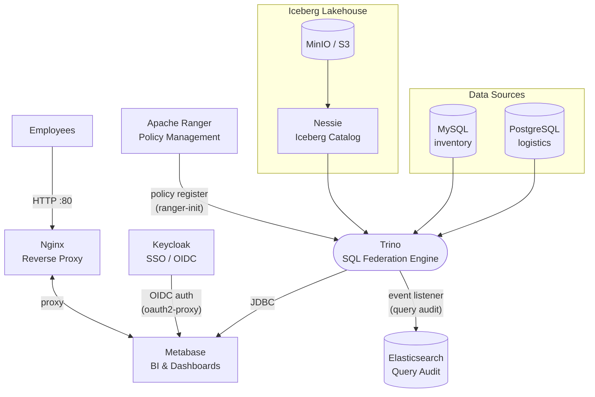

# Architecture — DataWave SQL Federation Platform

## System Diagram


The diagram above is the actual implementation. Employees enter through **Nginx**, authenticate via **Keycloak** (OIDC/SSO), and land on **Metabase**. Metabase queries **Trino** — the single SQL federation endpoint that federates **PostgreSQL**, **MySQL**, and an **Iceberg** lakehouse on **MinIO/S3**. Access policies are defined in **Apache Ranger** and enforced by Trino's file-based rule engine. Every completed query is streamed to **Elasticsearch** via Trino's HTTP event listener.



---

## Design Philosophy

This stack was built around three principles:

1. **Single SQL endpoint.** Analysts write standard SQL against one address (`trino:8080`) regardless of whether the data lives in PostgreSQL, MySQL, or an Iceberg data lake on object storage. No data is duplicated or moved between systems.

2. **Open standards at every layer.** Trino (SQL), Iceberg (open table format), OIDC/OAuth2 (identity), S3 (object storage), and Elasticsearch (audit) are all vendor-neutral. Every component can be swapped without rewriting application code.

3. **Security at the infrastructure layer, not the application layer.** Access control (Ranger), identity (Keycloak), and secret injection (Docker secrets) are enforced before any query reaches data — not inside application code.

---

## Network Map

All containers share a single Docker bridge network `datawave-net` (`172.20.0.0/16`). Services reach each other by container name via Docker DNS. No inter-service traffic leaves the Docker network.

```
┌─────────────────────────────── datawave-net  172.20.0.0/16 ────────────────────────────────────┐
│                                                                                                  │
│   INGRESS                                                                                        │
│  ─────────                                                                                       │
│  Employees ──► nginx:80 ──────────────────────────────────────────────────────────────────────┐ │
│                   │                                                                             │ │
│                   ├── /           ──► oauth2-proxy:4180 ──► metabase:3000                     │ │
│                   ├── /trino/     ──► trino:8080                                               │ │
│                   ├── /ranger/    ──► ranger:6080                                              │ │
│                   ├── /minio/     ──► minio:9001                                               │ │
│                   └── /kibana/    ──► kibana:5601                                              │ │
│                                                                                                 │ │
│   AUTH                                                                                          │ │
│  ──────                                                                                         │ │
│  oauth2-proxy ──► keycloak:8080 (OIDC token validation)                                        │ │
│  keycloak ──────► keycloak-db:5432 (session/realm store)                                       │ │
│                                                                                                 │ │
│   QUERY ENGINE                                                                                  │ │
│  ─────────────                                                                                  │ │
│  metabase:3000 ──► trino:8080 (JDBC/HTTP)                                                      │ │
│  trino:8080 ──────► postgres:5432     (logistics catalog connector)                             │ │
│             ──────► mysql:3306        (inventory catalog connector)                             │ │
│             ──────► nessie:19120      (iceberg catalog — metadata)                             │ │
│             ──────► minio:9000        (iceberg data — Parquet files)                           │ │
│             ──────► elasticsearch:9200 (async: query audit events)                             │ │
│                                                                                                 │ │
│   AUTHORIZATION STACK                                                                           │ │
│  ────────────────────                                                                           │ │
│  ranger:6080 ──────► ranger-db:5432   (policy store)                                          │ │
│              ──────► ranger-solr:8983 (audit index)                                            │ │
│                                                                                                 │ │
│   OBSERVABILITY                                                                                 │ │
│  ───────────────                                                                                │ │
│  elasticsearch:9200 ◄── trino (query audit), ranger (access audit)                            │ │
│  kibana:5601 ────────── elasticsearch:9200                                                     │ │
│                                                                                                 │ │
│   OBJECT STORAGE                                                                                │ │
│  ───────────────                                                                                │ │
│  nessie:19120 ──────► minio:9000      (reads/writes Parquet metadata)                         │ │
│                                                                                                 │ │
└─────────────────────────────────────────────────────────────────────────────────────────────────┘
```

### Port Reference

| Host Port | Container | Protocol | Access |
|---|---|---|---|
| **80** | nginx | HTTP | Public — only external entry point |
| **3000** | metabase | HTTP | Dev-only direct access |
| **4180** | oauth2-proxy | HTTP | Dev-only |
| **5432** | postgres (logistics) | TCP/PostgreSQL | Dev-only JDBC |
| **3306** | mysql (inventory) | TCP/MySQL | Dev-only JDBC |
| **6080** | ranger | HTTP | Dev-only admin UI |
| **8080** | trino | HTTP | Dev-only Web UI + JDBC |
| **8180** | keycloak | HTTP | Admin console |
| **8983** | ranger-solr | HTTP | Dev-only |
| **9000** | minio | S3/HTTP | Dev-only S3 API |
| **9001** | minio | HTTP | Dev-only browser console |
| **9200** | elasticsearch | HTTP | Dev-only REST API |
| **9300** | elasticsearch | TCP | Internal transport (not mapped) |
| **5601** | kibana | HTTP | Dev-only (also via `/kibana/`) |
| **19120** | nessie | HTTP | Dev-only REST catalog |

> In production, only port **80** (or **443**) should be reachable from outside. All other ports exist for local development debugging only.

---

## Service Reference

---

### Nginx — Reverse Proxy

**Why chosen:** Nginx is the de-facto standard for containerised reverse proxying. Its path-based `location` blocks route all sub-paths to the correct upstream with zero application code changes. Single entry point means one place to add TLS, rate limiting, and access logging.

**Role in this stack:** Terminates all inbound HTTP from employees. Routes sub-paths to oauth2-proxy, Trino UI, Ranger, MinIO console, and Kibana. Does not perform authentication itself — it delegates that to oauth2-proxy.

| Property | Value |
|---|---|
| Image | `nginx:latest` |
| Container | `datawave-nginx` |
| Internal port | `80` |
| Host port | `80` |
| Config file | `nginx/nginx.conf`, `nginx/conf.d/` |
| Calls | `oauth2-proxy:4180`, `trino:8080`, `ranger:6080`, `minio:9001`, `kibana:5601` |
| Called by | Employee browsers |
| Secrets | none |
| Health check | none (starts after metabase and oauth2-proxy are up) |

**Routing table:**

| Path | Upstream |
|---|---|
| `/` | `oauth2-proxy:4180` → Metabase (SSO protected) |
| `/trino/` | `trino:8080` (Web UI) |
| `/ranger/` | `ranger:6080` |
| `/minio/` | `minio:9001` |
| `/kibana/` | `kibana:5601` |

---

### OAuth2 Proxy — SSO Gateway

**Why chosen:** oauth2-proxy is a lightweight, provider-agnostic OIDC/OAuth2 enforcement sidecar. It puts an authentication gate in front of any HTTP application without modifying that application. Avoids upgrading Metabase to Enterprise just to add SSO.

**Role in this stack:** Intercepts all traffic destined for Metabase. If a valid Keycloak session cookie is present, it proxies the request forward. If not, it redirects the browser to the Keycloak login page. After login, Keycloak issues a JWT; oauth2-proxy validates it, sets an encrypted session cookie, and lets the request through.

| Property | Value |
|---|---|
| Image | `quay.io/oauth2-proxy/oauth2-proxy:v7.6.0-alpine` |
| Container | `datawave-oauth2-proxy` |
| Internal port | `4180` |
| Host port | `4180` |
| Calls | `keycloak:8080` (OIDC discovery + token validation), `metabase:3000` (upstream) |
| Called by | `nginx` |
| Secrets | `oauth2_client_secret.txt`, `oauth2_cookie_secret.txt` |
| Health check | none |

**Key flags:**

```
--provider=keycloak-oidc
--client-id=datawave-app
--client-secret-file=/run/secrets/oauth2_client_secret
--oidc-issuer-url=http://localhost:8180/realms/datawave
--redirect-url=http://localhost/oauth2/callback
--upstream=http://metabase:3000
--email-domain=*                   (any email domain allowed)
--skip-provider-button=true        (redirect immediately, no click)
--cookie-secure=false              (HTTP-only dev; set true for HTTPS prod)
```

**Authentication flow:**

```
Employee → nginx → oauth2-proxy
                       │
              No cookie? → redirect to Keycloak login
                       │
              Valid cookie? → proxy to metabase:3000
```

**Secret injection:** Cookie secret has no native file flag, so a shell wrapper reads `oauth2_cookie_secret.txt` and exports `OAUTH2_PROXY_COOKIE_SECRET`. Client secret uses the native `--client-secret-file` flag.

---

### Keycloak — Identity Provider

**Why chosen:** Keycloak is the industry-standard open-source OIDC/SAML identity provider. It ships a portable realm JSON that can be committed to git and imported on first boot — making the entire user/role configuration version-controlled and reproducible. Supports OIDC, SAML, LDAP federation, social login, MFA, and brute-force protection out of the box.

**Role in this stack:** Issues signed JWT tokens after employees authenticate. Holds the `datawave` realm with pre-configured users, roles, and clients. OAuth2 Proxy validates tokens against Keycloak's public keys.

| Property | Value |
|---|---|
| Image | `quay.io/keycloak/keycloak:24.0` |
| Container | `datawave-keycloak` |
| Internal port | `8080` |
| Host port | `8180` (mapped to avoid conflict with Trino's 8080) |
| Admin URL | http://localhost:8180 |
| Realm | `datawave` |
| Depends on | `keycloak-db` (healthy) |
| Calls | `keycloak-db:5432` |
| Called by | `oauth2-proxy` (token validation), browsers (login page) |
| Secrets | `keycloak_db_password.txt`, `keycloak_admin_password.txt` |
| Health check | TCP `GET /health/ready` every 30s, 90s start period |

**Environment variables:**

```yaml
KC_DB: postgres
KC_DB_URL: jdbc:postgresql://keycloak-db:5432/keycloak
KC_DB_USERNAME: keycloak
KC_DB_PASSWORD: <from secret>        # injected via shell wrapper
KEYCLOAK_ADMIN: admin
KEYCLOAK_ADMIN_PASSWORD: <from secret>
KC_HOSTNAME: localhost
KC_HOSTNAME_PORT: "8180"
KC_HTTP_ENABLED: "true"
KC_HEALTH_ENABLED: "true"
```

**Pre-configured realm (`keycloak/datawave-realm.json`):**

| Username | Realm Roles | Trino Group |
|---|---|---|
| `analyst` | `data-analyst` | `data-analyst` |
| `engineer` | `data-analyst`, `data-engineer` | `data-analyst`, `data-engineer` |
| `admin` | `data-analyst`, `data-engineer`, `data-admin` | all groups |
| `krishna` | `data-analyst`, `data-engineer`, `data-admin` | all groups |

| Client ID | Used by | Type |
|---|---|---|
| `datawave-app` | oauth2-proxy | Confidential (secret in `oauth2_client_secret.txt`) |
| `trino-cli` | CLI users | Public (no secret required) |

**Token lifecycle:**

| Token | TTL | Purpose |
|---|---|---|
| `access_token` | 5 min | Authorises Trino API calls |
| `refresh_token` | 30 min | oauth2-proxy uses this for silent renewal |
| Session cookie | 7 days | oauth2-proxy session; set via `--cookie-expire` |

---

### Keycloak DB — Keycloak Application Database

**Why chosen:** Keycloak requires a relational store for its realm, session, and event data. PostgreSQL 15 is used here for consistency with the other internal databases in this stack.

**Role in this stack:** Stores Keycloak's internal state (realm configuration, users, sessions, events). Internal only — not exposed to any external service.

| Property | Value |
|---|---|
| Image | `postgres:15` |
| Container | `datawave-keycloak-db` |
| Internal port | `5432` |
| Host port | none (internal only) |
| Volume | `keycloak_db_data` |
| Called by | `keycloak` only |
| Secrets | `keycloak_db_password.txt` |

**Environment variables:**

```yaml
POSTGRES_USER: keycloak
POSTGRES_DB: keycloak
POSTGRES_PASSWORD_FILE: /run/secrets/keycloak_db_password   # native _FILE pattern
```

---

### Metabase — BI / Analytics Layer

**Why chosen:** Metabase is the most widely adopted open-source BI tool with native Trino/Presto JDBC support. Analysts can build dashboards, write SQL, schedule reports, and share results without any local software installation. The free Community edition covers all features needed here.

**Role in this stack:** Provides the SQL editor and dashboard interface for analysts and engineers. Connects to Trino via a single pre-configured connection ("DataWave Federation") using the `admin` identity. Trino's file-based RBAC (`rules.json`) enforces per-user access control — demonstrable via the Trino CLI with `--user <identity>` (see `docs/user-guide.md`).

| Property | Value |
|---|---|
| Image | `metabase/metabase:latest` |
| Container | `datawave-metabase` |
| Internal port | `3000` |
| Host port | `3000` |
| Depends on | `metabase-db` (healthy), `trino` (healthy) |
| Calls | `trino:8080` (JDBC queries), `metabase-db:5432` (app database) |
| Called by | `oauth2-proxy` (proxies browser traffic), `nginx` |
| Secrets | `metabase_db_password.txt` |
| Health check | `GET /api/health` every 30s, 120s start period |

**Environment variables:**

```yaml
MB_DB_TYPE: postgres
MB_DB_DBNAME: metabase
MB_DB_PORT: 5432
MB_DB_HOST: metabase-db
MB_DB_USER: metabase
MB_DB_PASS: <from secret>    # injected via shell wrapper
```

**Pre-configured Trino connection** (created by `metabase/init.sh`):

| Connection name | Trino user | Purpose |
|---|---|---|
| DataWave Federation | `admin` | Full access to all catalogs; RBAC tested via Trino CLI `--user` flag |

---

### Metabase DB — Metabase Application Database

**Why chosen:** Metabase requires a relational store for its questions, dashboards, users, and settings. PostgreSQL 15 gives it a production-grade backend instead of the default H2 file database (which is not suitable for multi-user or persistent deployments).

| Property | Value |
|---|---|
| Image | `postgres:15` |
| Container | `datawave-metabase-db` |
| Internal port | `5432` |
| Host port | none (internal only) |
| Volume | `metabase_db_data` |
| Called by | `metabase` only |
| Secrets | `metabase_db_password.txt` |

**Environment variables:**

```yaml
POSTGRES_USER: metabase
POSTGRES_DB: metabase
POSTGRES_PASSWORD_FILE: /run/secrets/metabase_db_password   # native _FILE pattern
```

---

### Trino — SQL Federation Engine

**Why chosen:** Trino is purpose-built for federated SQL: it pushes predicates to each source system and merges results in memory without ETL or data movement. A single JDBC/HTTP endpoint simplifies every downstream consumer. The Trino connector model supports RDBMS (PostgreSQL, MySQL), object-store formats (Iceberg), and built-in benchmark datasets (tpch) — all with the same SQL dialect. Version `458` is pinned because the catalog API changes between minor versions.

**Role in this stack:** The central query hub. Receives SQL from Metabase (or any JDBC client), checks each operation against Ranger (authorization), and routes sub-queries to PostgreSQL, MySQL, or Iceberg/MinIO.

| Property | Value |
|---|---|
| Image | `trinodb/trino:458` |
| Container | `datawave-trino` |
| Internal port | `8080` |
| Host port | `8080` |
| Web UI | http://localhost/trino/ |
| Depends on | `postgres`, `mysql`, `minio`, `nessie`, `elasticsearch` (all healthy) |
| Calls | `postgres:5432`, `mysql:3306`, `nessie:19120`, `minio:9000`, `elasticsearch:9200`, `ranger:6080` |
| Called by | `metabase`, JDBC clients, Trino CLI |
| Secrets | `postgres_password.txt`, `mysql_password.txt`, `minio_root_password.txt`, `elasticsearch_password.txt` |
| Health check | `GET /v1/info` every 15s, 60s start period |

**`trino/etc/config.properties`:**

```properties
coordinator=true
node-scheduler.include-coordinator=true
http-server.http.port=8080
discovery.uri=http://localhost:8080
http-server.process-forwarded=true
query.max-memory=2GB
query.max-memory-per-node=512MB
web-ui.enabled=true
event-listener.config-files=etc/event-listener.properties
```

**`trino/etc/access-control.properties`:**

```properties
access-control.name=file
security.config-file=etc/rules.json
```

**`trino/etc/group-provider.properties`:**

```properties
group-provider.name=file
file.group-file=etc/groups.txt
```

**`trino/etc/groups.txt`:**

```
data-analyst:analyst,engineer,admin,krishna
data-engineer:engineer,admin,krishna
data-admin:admin,krishna
```

**`trino/etc/catalog/postgresql.properties`:**

```properties
connector.name=postgresql
connection-url=jdbc:postgresql://postgres:5432/logistics
connection-user=datawave
connection-password=${ENV:TRINO_POSTGRES_PASSWORD}
postgresql.array-mapping=AS_ARRAY
```

**`trino/etc/catalog/mysql.properties`:**

```properties
connector.name=mysql
connection-url=jdbc:mysql://mysql:3306
connection-user=datawave
connection-password=${ENV:TRINO_MYSQL_PASSWORD}
```

**`trino/etc/catalog/iceberg.properties`:**

```properties
connector.name=iceberg
iceberg.catalog.type=nessie
iceberg.nessie-catalog.uri=http://nessie:19120/api/v1
iceberg.nessie-catalog.ref=main
iceberg.nessie-catalog.default-warehouse-dir=s3://warehouse/
fs.native-s3.enabled=true
s3.endpoint=http://minio:9000
s3.region=us-east-1
s3.path-style-access=true
s3.aws-access-key=minioadmin
s3.aws-secret-key=${ENV:TRINO_MINIO_SECRET_KEY}
```

**Event listener** (written at container startup into `/etc/trino/event-listener.properties`):

```properties
event-listener.name=http
http-event-listener.connect-ingest-uri=http://elasticsearch:9200/trino-query-audit/_doc
http-event-listener.connect-http-headers=Authorization: Basic <base64 elastic:password>
http-event-listener.log-completed=true
http-event-listener.log-created=false
http-event-listener.log-split=false
```

**RBAC rules (`trino/etc/rules.json`) — summary:**

| Group | Catalogs | Privileges | Notes |
|---|---|---|---|
| `data-admin` | all (`.*`) | ALL + OWNERSHIP | Full DML on all catalogs |
| `data-engineer` | `postgresql`, `mysql`, `iceberg` | SELECT + INSERT + UPDATE + DELETE | Schema ownership on iceberg |
| `data-engineer` | `tpch`, `system` | SELECT | Read-only on benchmark/system |
| `data-analyst` | `postgresql`, `mysql`, `iceberg`, `tpch` | SELECT | `credit_card` masked to NULL |
| (default) | all | NONE | Implicit deny |

---

### PostgreSQL — Logistics Data Source

**Why chosen:** PostgreSQL 15 is the most feature-complete open-source RDBMS. The Trino PostgreSQL connector is the most mature in the ecosystem. Represents operational OLTP data — the kind of source Trino most commonly federates in real deployments.

**Role in this stack:** Holds the logistics schema: customers, shipping routes, and individual shipments. Demonstrates Trino's ability to query relational data with full pushdown, JOINs, and column-level security.

| Property | Value |
|---|---|
| Image | `postgres:15` |
| Container | `datawave-postgres` |
| Internal port | `5432` |
| Host port | `5432` |
| Database | `logistics` |
| User | `datawave` |
| Volume | `postgres_data` |
| Init scripts | `postgres/init/` |
| Called by | `trino` (connector) |
| Secrets | `postgres_password.txt` |
| Health check | `pg_isready -U datawave -d logistics` every 10s |

**Environment variables:**

```yaml
POSTGRES_USER: datawave
POSTGRES_DB: logistics
POSTGRES_PASSWORD_FILE: /run/secrets/postgres_password   # native _FILE pattern
```

**Schema — `logistics`:**

| Table | Columns | Description |
|---|---|---|
| `customers` | `customer_id`, `company_name`, `country`, `region`, `contact_email`, `credit_card` | Global customer accounts; `credit_card` is masked for `data-analyst` group |
| `routes` | `route_id`, `origin`, `destination`, `carrier`, `transit_days`, `cost_per_kg` | Shipping lane definitions |
| `shipments` | `shipment_id`, `customer_id`, `route_id`, `weight_kg`, `status`, `dispatched_at`, `delivered_at` | Active and historical shipment records |

**Sample seed data:**

```
customers (5 rows):
  Acme Corp (US)          credit_card: 4111-1111-1111-1111
  Global Trade Ltd (DE)   credit_card: 5500-0000-0000-0004
  Pacific Freight (JP)    credit_card: 3714-496353-98431
  Euro Logistics (FR)     credit_card: 6011-1111-1111-1117
  Amazon Basin (BR)       credit_card: 3056-9309-0259-04

routes (7 rows):
  New York → Los Angeles (FastShip, 3 days, $1.20/kg)
  Hamburg → Rotterdam (EuroCarrier, 1 day, $0.80/kg)
  Tokyo → Seoul (AsiaPac, 2 days, $1.50/kg)
  New York → Hamburg (OceanLine, 12 days, $0.45/kg)
  Los Angeles → Tokyo (PacificRoute, 14 days, $0.38/kg)
  ... and 2 more

shipments (10 rows):
  Statuses: DELIVERED, IN_TRANSIT, PENDING
  Weights: 55.75 kg to 620.00 kg
```

---

### MySQL — Inventory Data Source

**Why chosen:** MySQL 8.0 is the world's most deployed open-source RDBMS in inventory and ERP systems. Including it alongside PostgreSQL demonstrates that Trino truly federates heterogeneous sources — the analyst writes one SQL query and Trino handles the protocol differences transparently.

**Role in this stack:** Holds the inventory schema: warehouses, suppliers, and stock levels per SKU. Demonstrates cross-source JOINs between MySQL inventory data and PostgreSQL logistics data in a single Trino query.

| Property | Value |
|---|---|
| Image | `mysql:8.0` |
| Container | `datawave-mysql` |
| Internal port | `3306` |
| Host port | `3306` |
| Database | `inventory` |
| User | `datawave` |
| Volume | `mysql_data` |
| Init scripts | `mysql/init/` |
| Called by | `trino` (connector) |
| Secrets | `mysql_root_password.txt`, `mysql_password.txt` |
| Health check | `mysqladmin ping -h localhost --silent` every 10s |

**Environment variables:**

```yaml
MYSQL_DATABASE: inventory
MYSQL_USER: datawave
MYSQL_ROOT_PASSWORD_FILE: /run/secrets/mysql_root_password   # native _FILE pattern
MYSQL_PASSWORD_FILE: /run/secrets/mysql_password             # native _FILE pattern
```

**Schema — `inventory`:**

| Table | Columns | Description |
|---|---|---|
| `warehouses` | `warehouse_id`, `warehouse_name`, `city`, `country`, `capacity_m3` | Global distribution centres |
| `suppliers` | `supplier_id`, `supplier_name`, `country`, `lead_time_days`, `reliability`, `contact_email` | Vendor reliability scores and lead times |
| `inventory` | `inventory_id`, `warehouse_id`, `supplier_id`, `sku`, `product_name`, `quantity`, `unit_weight`, `reorder_level` | SKU stock levels per warehouse |

**Sample seed data:**

```
warehouses (5 rows):
  Northeast Hub — New York, US (50,000 m³)
  West Coast DC — Los Angeles, US (65,000 m³)
  Central Europe — Frankfurt, DE (80,000 m³)
  Asia Pacific Hub — Tokyo, JP (45,000 m³)
  LATAM Depot — São Paulo, BR (30,000 m³)

inventory (10 rows, some below reorder level):
  ELC-001  Electronic Sensors     qty: 1200  reorder: 200   (healthy)
  PKG-010  Packaging Foam Rolls   qty: 60    reorder: 100   (⚠ below reorder)
  ELC-002  GPS Trackers           qty: 80    reorder: 150   (⚠ below reorder)
  HWD-005  Steel Brackets         qty: 3000  reorder: 500   (healthy)
  IND-020  Industrial Cables      qty: 25    reorder: 50    (⚠ below reorder)
  ELC-004  Barcode Scanners       qty: 40    reorder: 80    (⚠ below reorder)
```

---

### MinIO — Object Storage

**Why chosen:** MinIO provides a fully S3-compatible API in a single Docker container with no AWS account required. Iceberg reads and writes Parquet files using the standard S3 protocol — swapping MinIO for a real AWS S3 bucket requires only changing the endpoint URL and credentials.

**Role in this stack:** Stores all Iceberg data files (Parquet) and metadata. Three buckets are provisioned by `minio-init`: `warehouse` (Iceberg tables), `raw-data` (ingestion landing zone), `archive` (historical snapshots).

| Property | Value |
|---|---|
| Image | `minio/minio:latest` |
| Container | `datawave-minio` |
| S3 API port | `9000` (internal + host) |
| Console port | `9001` (internal + host) |
| Console URL | http://localhost/minio/ |
| Volume | `minio_data` |
| Called by | `nessie`, `trino` (via nessie for Parquet I/O) |
| Secrets | `minio_root_password.txt` |
| Health check | `GET /minio/health/live` every 10s |

**Environment variables** (injected via shell wrapper):

```bash
MINIO_ROOT_USER=minioadmin
MINIO_ROOT_PASSWORD=<from minio_root_password.txt>
MINIO_BROWSER_REDIRECT_URL=http://localhost/minio
MINIO_CONSOLE_SUBPATH=/minio
```

**Buckets (created by `minio/init.sh`):**

| Bucket | Purpose |
|---|---|
| `warehouse` | Iceberg table data and metadata (Nessie-managed) |
| `raw-data` | Landing zone for upstream data ingestion |
| `archive` | Historical snapshots and backups |

---

### Nessie — Iceberg REST Catalog

**Why chosen:** Project Nessie provides a git-like branching model for Iceberg metadata. Tables can be created on feature branches and merged, enabling safe schema evolution and rollback. It implements the Iceberg REST catalog spec, so Trino's standard Iceberg connector works without custom code. In-memory persistence is used for this dev stack; switch to a persistent backend (RocksDB, DynamoDB) for production.

**Role in this stack:** Acts as the Iceberg REST catalog. When Trino queries `iceberg.*.*`, it asks Nessie for the table's current snapshot and metadata location, then reads Parquet files from MinIO directly.

| Property | Value |
|---|---|
| Image | `projectnessie/nessie:latest` |
| Container | `datawave-nessie` |
| Internal port | `19120` |
| Host port | `19120` |
| Depends on | nothing (starts independently) |
| Calls | `minio:9000` (via Trino's S3 layer — Nessie itself only manages metadata) |
| Called by | `trino` (catalog metadata lookups) |
| Secrets | none |
| Health check | `GET /api/v2/config` every 15s, 30s start period |

**Environment variables:**

```yaml
QUARKUS_PROFILE: prod
NESSIE_VERSION_STORE_TYPE: IN_MEMORY   # switch to ROCKS_DB or DYNAMO for production
```

---

### Apache Ranger — Authorization Engine

**Why chosen:** Apache Ranger is the de-facto standard for fine-grained access control in the Hadoop/data platform ecosystem. It operates at catalog, schema, table, and column granularity — far more expressive than file-system ACLs or simple role-based flags. Its policy UI allows non-engineers to manage access without touching config files, and every decision is logged to an immutable audit trail.

**Role in this stack:** Policy management UI and audit log viewer for the Trino federation layer. The `ranger-init` container registers a `datawave_trino` service instance in Ranger on first boot, making the policy hierarchy visible in the Ranger UI. Actual per-query enforcement is handled by Trino's file-based rule engine (`rules.json` + `groups.txt`) — the two policy models are kept in sync manually. Every Ranger authorization decision is indexed in `ranger-solr` and searchable from the Ranger Audit UI.

> **Production path:** In a production deployment, the Ranger-Trino authorizer plugin would be installed into the Trino JVM so Ranger enforces policies at query time without `rules.json`. The plugin binary is not pre-built for Ranger 2.8.0; building it from source is the production next step. See [`prod-improvements.md`](prod-improvements.md#ranger-policy-sync-for-trino) for the full implementation path.

| Property | Value |
|---|---|
| Image | `apache/ranger:2.8.0` |
| Container | `datawave-ranger` |
| Internal port | `6080` |
| Host port | `6080` |
| Admin URL | http://localhost/ranger/ |
| Depends on | `ranger-db` (healthy), `ranger-solr` (healthy) |
| Calls | `ranger-db:5432`, `ranger-solr:8983`, `elasticsearch:9200` (audit) |
| Called by | `ranger-init` (service registration on startup), admin browser |
| Secrets | `ranger_db_password.txt`, `ranger_admin_password.txt` |
| Health check | `GET /login.jsp` every 30s, 180s start period |

**Environment variables:**

```yaml
RANGER_DB_TYPE: postgres
RANGER_DB_USER: rangeradmin
# RANGER_DB_PASSWORD and RANGER_ADMIN_PASSWORD injected via entrypoint.sh
```

**Pre-loaded policies (in `datawave_trino` service):**

| Policy | Group | Resource | Access |
|---|---|---|---|
| PostgreSQL logistics — role-based | `data-analyst` | `postgresql.logistics.*` | SELECT |
| | `data-engineer` | `postgresql.logistics.*` | SELECT + INSERT + UPDATE + DELETE |
| | `data-admin` | `postgresql.logistics.*` | ALL |
| MySQL inventory — role-based | `data-analyst` | `mysql.inventory.*` | SELECT |
| | `data-engineer` | `mysql.inventory.*` | SELECT + DML |
| | `data-admin` | `mysql.inventory.*` | ALL |
| Iceberg data lake | `data-analyst` | `iceberg.*.*` | SELECT |
| | `data-engineer` | `iceberg.*.*` | SELECT + DML + CREATE + DROP |
| | `data-admin` | `iceberg.*.*` | ALL |
| DENY — analyst/system | `data-analyst` | `system.*.*` | DENY ALL |

---

### Ranger DB — Ranger Policy Store

**Why chosen:** PostgreSQL 15 for consistency with other internal databases.

**Role in this stack:** Persists Ranger policies, users, groups, and audit metadata. Internal only.

| Property | Value |
|---|---|
| Image | `postgres:15` |
| Container | `datawave-ranger-db` |
| Internal port | `5432` |
| Host port | none (internal only) |
| Volume | `ranger_db_data` |
| Called by | `ranger` only |
| Secrets | `ranger_db_password.txt` |

**Environment variables:**

```yaml
POSTGRES_USER: postgres
POSTGRES_DB: ranger
POSTGRES_PASSWORD_FILE: /run/secrets/ranger_db_password   # native _FILE pattern
```

---

### Ranger Solr — Audit Index

**Why chosen:** Apache Solr is Ranger's native audit index backend, pre-packaged in the `apache/ranger-solr` image. It is pinned to `2.8.0` to match the Ranger version exactly.

**Role in this stack:** Indexes all Ranger authorization decisions so they are searchable from the Ranger Admin Audit UI.

| Property | Value |
|---|---|
| Image | `apache/ranger-solr:2.8.0` |
| Container | `datawave-ranger-solr` |
| Internal port | `8983` |
| Host port | `8983` |
| Called by | `ranger` only |
| Secrets | none |
| Health check | `GET /solr/` every 15s, 30s start period |

---

### Elasticsearch — Audit Store

**Why chosen:** Elasticsearch 8.x provides near-real-time full-text search over structured JSON events. Trino's HTTP Event Listener ships query audit records as JSON documents via a single HTTP POST per query — Elasticsearch accepts them natively without any schema setup. Kibana (co-versioned) provides the dashboard layer. Both are pinned to `8.13.0` because Elasticsearch and Kibana must match exactly.

**Role in this stack:** Receives two audit streams:
1. **`trino-query-audit` index** — every completed Trino query (SQL text, user, duration, bytes scanned, error code). Written by Trino's HTTP Event Listener.
2. **`ranger-audit` index** — every Ranger authorization decision (allow/deny, user, resource, policy matched). Written by Ranger.

| Property | Value |
|---|---|
| Image | `elasticsearch:8.13.0` |
| Container | `datawave-elasticsearch` |
| HTTP port | `9200` (internal + host) |
| Transport port | `9300` (internal only) |
| Volume | `es_data` |
| Config file | `elasticsearch/elasticsearch.yml` |
| Called by | `trino` (event listener), `ranger` (audit), `kibana`, `es-init` |
| Secrets | `elasticsearch_password.txt` |
| Health check | `GET /_cluster/health?wait_for_status=yellow` every 20s, 60s start period |

**Environment variables:**

```yaml
discovery.type: single-node
xpack.security.enabled: "true"
ES_JAVA_OPTS: "-Xms512m -Xmx512m"
cluster.name: datawave-audit
ELASTIC_PASSWORD: <from secret>    # injected via shell wrapper
```

**Indices:**

| Index | Written by | Key fields |
|---|---|---|
| `trino-query-audit` | Trino HTTP Event Listener | `queryId`, `principal`, `query`, `@timestamp`, `errorType`, `errorCode` |
| `ranger-audit` | Apache Ranger | `user`, `resource`, `action`, `result` (1=allow/0=deny), `reason`, `evtTime` |

---

### Kibana — Audit Dashboard

**Why chosen:** Kibana is the standard UI for Elasticsearch. Co-versioned with Elasticsearch (`8.13.0`), it provides Discover (ad-hoc search), Lens (drag-and-drop visualisation), and Dashboard (composable panels) — all over the audit indices without additional setup.

**Role in this stack:** Lets administrators search and visualise query audit trails and authorization decisions. Accessible at http://localhost/kibana/.

| Property | Value |
|---|---|
| Image | `kibana:8.13.0` |
| Container | `datawave-kibana` |
| Internal port | `5601` |
| Host port | `5601` |
| URL | http://localhost/kibana/ |
| Depends on | `elasticsearch` (healthy), `es-init` (completed) |
| Calls | `elasticsearch:9200` (as `kibana_system` user) |
| Called by | `nginx` |
| Secrets | `elasticsearch_password.txt` |
| Health check | none |

**Environment variables:**

```yaml
ELASTICSEARCH_HOSTS: '["http://elasticsearch:9200"]'
ELASTICSEARCH_USERNAME: kibana_system          # set by es-init
ELASTICSEARCH_PASSWORD: <from secret>
SERVER_BASEPATH: /kibana
SERVER_REWRITEBASEPATH: "true"
SERVER_PUBLICBASEURL: http://localhost/kibana
```

---

## Secrets & Injection Patterns

All credentials live in a single `.env` file at the project root. Docker Compose reads it automatically and substitutes `${VAR}` references in `docker-compose.yml`. Each service receives only the variables it needs via its `environment:` block.

```bash
# .env — committed dev defaults, never used in production
POSTGRES_PASSWORD=datawave123
ELASTICSEARCH_PASSWORD=ElasticPass@1
# ... one line per credential
```

### Credential inventory

| Variable | Consumed by |
|---|---|
| `POSTGRES_PASSWORD` | `postgres`, `trino` |
| `MYSQL_ROOT_PASSWORD` | `mysql` |
| `MYSQL_PASSWORD` | `mysql`, `trino` |
| `MINIO_ROOT_PASSWORD` | `minio`, `minio-init`, `trino` |
| `RANGER_DB_PASSWORD` | `ranger-db`, `ranger` |
| `RANGER_ADMIN_PASSWORD` | `ranger` |
| `KEYCLOAK_DB_PASSWORD` | `keycloak-db`, `keycloak` |
| `KEYCLOAK_ADMIN_PASSWORD` | `keycloak` |
| `METABASE_DB_PASSWORD` | `metabase-db`, `metabase` |
| `METABASE_ADMIN_PASSWORD` | `metabase-init` |
| `ELASTICSEARCH_PASSWORD` | `elasticsearch`, `es-init`, `kibana`, `kibana-init`, `trino` |
| `OAUTH2_CLIENT_SECRET` | `oauth2-proxy` |
| `OAUTH2_COOKIE_SECRET` | `oauth2-proxy` |

**Special case — Trino:** catalog connector files use Trino's own `${ENV:VAR_NAME}` substitution syntax. The Trino service also runs a minimal entrypoint to generate `event-listener.properties` at startup (it needs to base64-encode the Elasticsearch auth header, which can't be done statically). All values come from the container's environment, not from files.

---

## Service Startup Order

Docker Compose enforces `service_healthy` conditions, so services start in dependency order:

```
postgres (healthy ~10s) ────────────────────────────────────────┐
mysql (healthy ~10s) ───────────────────────────────────────────┤
minio (healthy ~10s) → minio-init                               ├──► trino (healthy ~60s)
nessie (healthy ~30s) ──────────────────────────────────────────┤         │
elasticsearch (healthy ~60s) → es-init ─────────────────────────┤         ▼
ranger-db (healthy ~10s) ──────────────────────────────────────►│    metabase (healthy ~120s)
ranger-solr (healthy ~30s) ──► ranger (healthy ~3min) ──► ranger-init ──►(unblocks trino)  │
                                                                            ▼
keycloak-db (healthy ~10s) ──► keycloak ──► oauth2-proxy ──────────────► nginx
```

**Critical path:** `ranger-db → ranger (~3 min) → ranger-init → trino → metabase → nginx`

**Total first-boot time: ~6–8 minutes.** Subsequent boots are faster because Ranger skips database setup.
